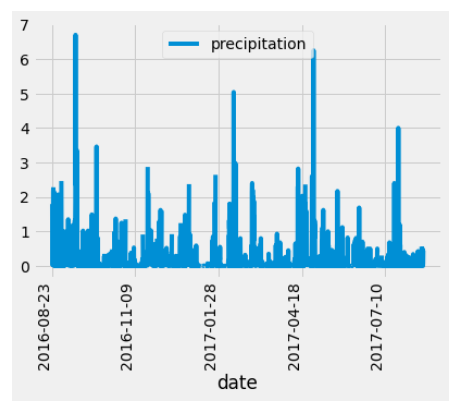
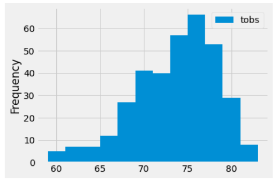

# surfs_up
Exploring weather data using Pandas, SQLite, SQLAlchemy, and Flask

## Project Background and Goals

Analysis the weather patterns  of a specific location on Oahu to build a shop. We'll plot the results of our precipitation analysis using Matplotlib and provide the statistical analysis—such as the mean, standard deviation, minimum, and maximum for specific date and location. Each segment of your analysis: Precipitation, Stations, MonthlyTemperature, and Statistics will be done using using SQLalchemy to query and create engine of connecting SQLite and python pandas. We will create our routes so that the board of directors can easily access our analysis with a Flask application.

Here is the goals of the weather data analysis:

- Performing data analysis and data exploration on a weather dataset,

- Using SQLalchemy to query and create engine of connecting SQLite and python pandas.

- Use statistics like minimum, maximum, and average to analyze data.

- Designing a Flask application to showcase a dynamic data analysis.

## The process of project
 
* Import Dependencies: matplotlib, datetime, sqlalchemy, Flask, etc.
* Connect to our SQLite database by creat_engine and session (link) from Python to the DB
* Exploratory climate analysis using query and filter, group_by, and order_by fuction.
* Plotting with Matplotlib to plot the data
* Create a summary of a few statistics that shows the precipitation per day and month.

## Software/Tools/Libraries
* Python 3.7.6, Jupyter Notebook 6.1.4 with PanDas, NumPy, Matplotlib, SQLAlchemy, and Flask.
* SQLite database and VS Code
* Data Source: hawaii.sqlite

### Major Outputs:

- Using the Python SQL toolkits and Object Relational Mapper, anaysis the precipitation data and temperature observation from the SQLite(hawaii.sqlite) database.

 - Retrieve the last 12 months of precipitation data from SQLite database and plot the results
 
  

  
 - The last 12 months of temperature observation data for this station ('USC00519281') and plot the results as a histogram
 
  

### The details can be found at the following files

- Surf_up_analysis jupyter notebooks

  [Climate_analysis.ipynb](climate_analysis.ipynb)
  
- Phython code to display in webpage with Flask
  
  [APP.PY](app.py)

# Challenge

Temperature analysis of Oahu island for the months of June and December in Oahu, in order to determine if the surf and ice cream shop business is sustainable year-round.

## Project Process:

1. Using Python, Pandas functions and methods, and SQLAlchemy, we will filter the date column of the  Measurements table in the  hawaii.sqlite database to retrieve all the temperatures for the month of June. Then, convert those temperatures to a list, create a DataFrame from the list, and generate the summary statistics.

2. filter the date column of the Measurements table in the hawaii.sqlite database to retrieve all the temperatures for the month of December.

### Results

- **Determine key statistical data about the month of June.**

- **Determine key statistical data about the month of December.**

- The details of the Summary Statistics of Monthcan be found at the following files*
  
  [SurfsUp_Challenge.ipynb](SurfsUp_Challenge.ipynb)

### Summary and conclustions

*Based on a comparison of precipitation and temperature between June and December from 2010 to 2017 , it’s possible to notice the following statistical information:*

 1. Over 7 years, there are 1574 precipitations occurred and 1700 temperatures  observed in June, higher than 1405 precipitations and 1517 temperatures  observed in December. The different (1700-1517 = 183) between two observations counts that indicate the data of Dec, 2017 not included in database.

 2. Comparing of precipitation, the mean (0.217) and median (0.03) of December are higher than June’s mean (0.136) and median (0.02), respectively. 

 3. For precipitation derivative indicators, December also had higher Standard Deviations and Maximum precipitation. In December, standard deviation (0.541) is higher than June’s standard deviation (0.336). The minimum of both December and June are zero, and December maximum (6.42) is higher than June (4.43).

 4. Comparing of temperatures, it apparently shows that June’s temperature indicators are higher than December.

### Recommendations for further analysis.**

 1. The lack of data in December, 2017  may cause less reliable of data. We also need to analysis the year trend to see how the wether changes yearly.

 2. In addition of statistical summery, various features and plots may help us better analyze the seasonal weather.

 3. For seasonal analysis, we need filter more detail precipitation and temperatures for Spring and Autumn. 
